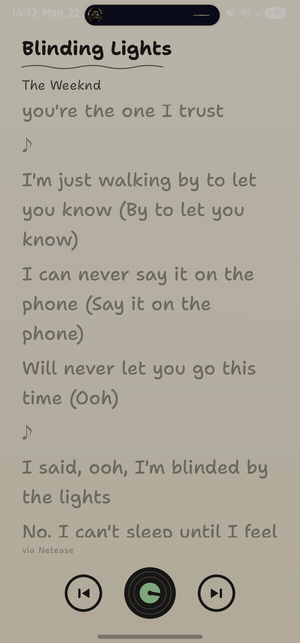
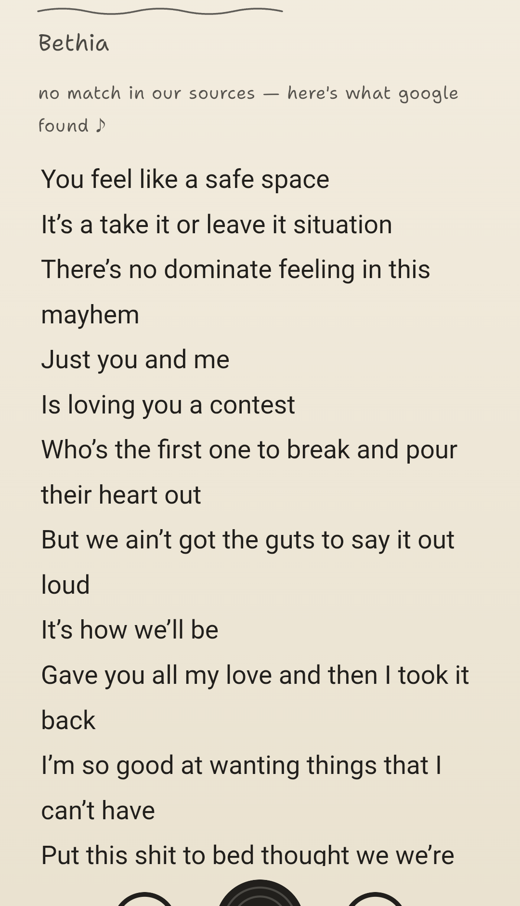
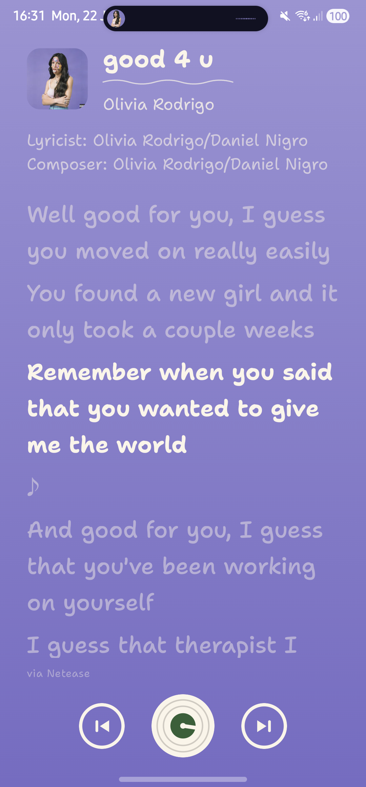
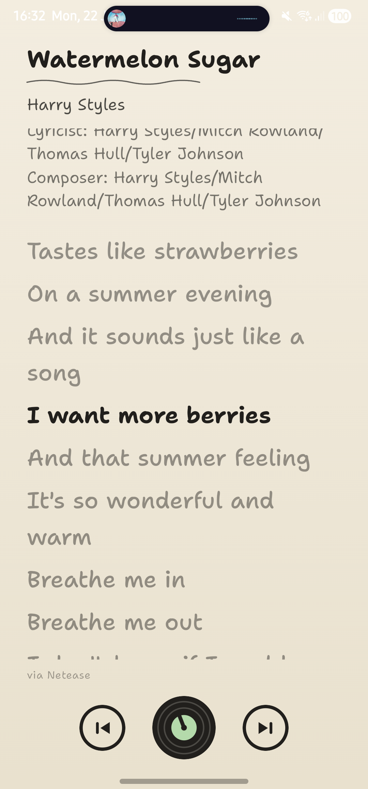
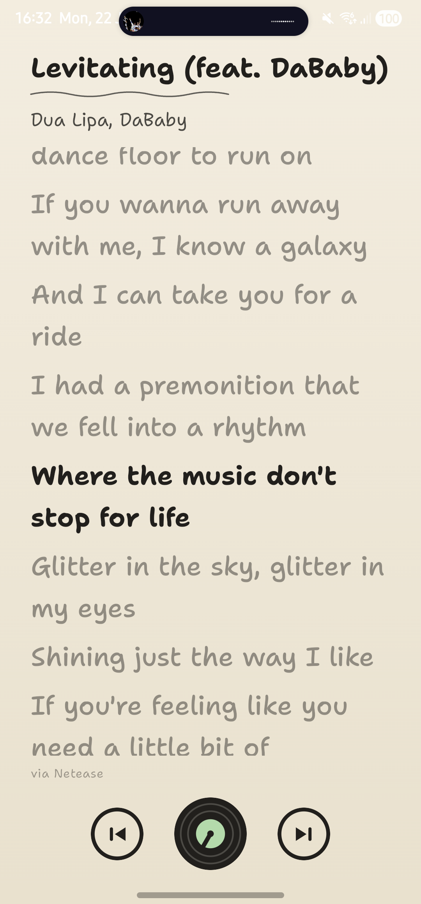

  

# LyricsOn

**Instant lyrics for whatever's playing** — synced, beautiful, zero setup. Play a
song in Spotify, YouTube Music, or any other player, open LyricsOn, and the words
are right there.

  

<em>Lyrics scroll in time with the song — and the little record spins while it plays.</em>

## 🧩 The problem LyricsOn solves

Music apps show lyrics by *licensing* them (Spotify gets its from Musixmatch).
That works great for the global hits — but there's a wide gap the moment you step
off the beaten path:

- **Independent & emerging artists** — frequently no lyrics at all.
- **Regional & non-English songs** — especially C-pop / Mandopop, and many Indian,
  Arabic, and African tracks with millions of plays.
- **Sped-up / slowed + reverb / remix versions** — the TikTok-viral edits almost
  never carry lyrics.
- **Brand-new releases** — lyrics often lag the drop by days or weeks.
- **Live, acoustic, and unofficial uploads.**

For all of these you tap "Lyrics" in your music app and get… nothing.

**LyricsOn fills that gap.** It searches LRCLIB, NetEase, QQ Music and Genius, and
when none of them have it, falls back to a live web "reader view" — so the words
show up even when your player gives up.

## 🎯 Built for the songs your app forgets

> **“Safe Side” by Bethia** — an independent R&B single — has **no lyrics in
> Spotify**. LyricsOn pulls them straight from the web.

  

That's the whole point: the track you can't find lyrics for *anywhere* is exactly
the one LyricsOn is built for.

## 🎨 A different look for every song

The background is painted from each album's colors, so every track gets its own mood.

  
  
  
  

## ⬇️ Download

**[➡️ Download the latest APK](../../releases/latest)** — open the link, grab the
`.apk` under *Assets*, and install it on your Android phone.

> 🇨🇳 **In China:** GitHub works without a VPN, but downloads can be slow. If the
> direct link stalls, prepend a mirror, e.g. paste the download URL after
> `https://ghproxy.com/` (so it becomes `https://ghproxy.com/https://github.com/.../LyricsOn.apk`).

Requirements: **Android 7.0+** (works on any Android, including phones without
Google services — Huawei, etc.).

## 📲 Install

1. Open the downloaded `.apk`. Android will ask to allow installing from this
   source — allow it.
2. Open **LyricsOn** and tap **Grant access** once (it needs notification access
   to see what's playing — it reads the media session only, nothing else).
3. **On Xiaomi / Huawei / Oppo / Vivo phones:** also turn on **Autostart** and
   **disable battery optimization** for LyricsOn in Settings, or the phone will
   kill it in the background and it won't detect your music.
4. Press play in your music app — lyrics appear.

## 🎵 Where lyrics come from

LyricsOn searches multiple sources, so even niche tracks are usually covered.
**In China**, NetEase, QQ Music, and LRCLIB work great (excellent for C-pop /
Mandopop). The Google-search fallback is blocked in China without a VPN, so a few
obscure Western-only songs may not resolve there.

## 🔒 Privacy

LyricsOn collects nothing. It reads only the **title and artist** of the current
track to look up lyrics, has no accounts/ads/analytics, and caches lyrics only on
your device. See [PRIVACY.md](PRIVACY.md).
